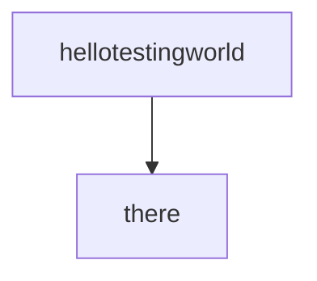
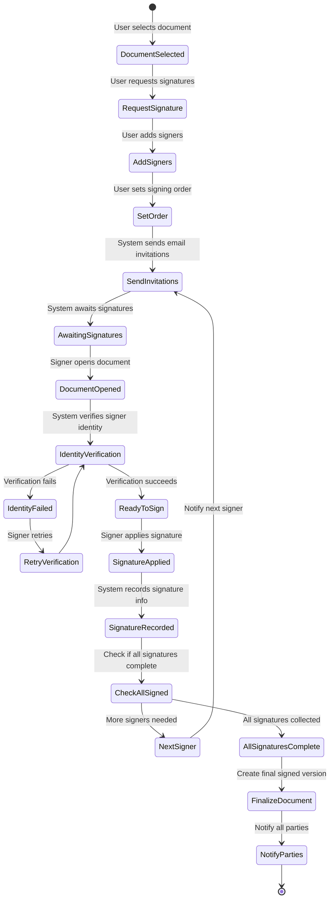

# Hello

```mermaid
graph
  hellotestingworld --> there
```

```mermaid
stateDiagram-v2
    [*] --> DocumentSelected: User selects document
    
    DocumentSelected --> RequestSignature: User requests signatures
    RequestSignature --> AddSigners: User adds signers
    AddSigners --> SetOrder: User sets signing order
    
    SetOrder --> SendInvitations: System sends email invitations
    SendInvitations --> AwaitingSignatures: System awaits signatures
    
    AwaitingSignatures --> DocumentOpened: Signer opens document
    DocumentOpened --> IdentityVerification: System verifies signer identity
    
    IdentityVerification --> IdentityFailed: Verification fails
    IdentityVerification --> ReadyToSign: Verification succeeds
    
    IdentityFailed --> RetryVerification: Signer retries
    RetryVerification --> IdentityVerification
    
    ReadyToSign --> SignatureApplied: Signer applies signature
    SignatureApplied --> SignatureRecorded: System records signature info
    
    SignatureRecorded --> CheckAllSigned: Check if all signatures complete
    
    CheckAllSigned --> NextSigner: More signers needed
    CheckAllSigned --> AllSignaturesComplete: All signatures collected
    
    NextSigner --> SendInvitations: Notify next signer
    
    AllSignaturesComplete --> FinalizeDocument: Create final signed version
    FinalizeDocument --> NotifyParties: Notify all parties
    
    NotifyParties --> [*]
```
